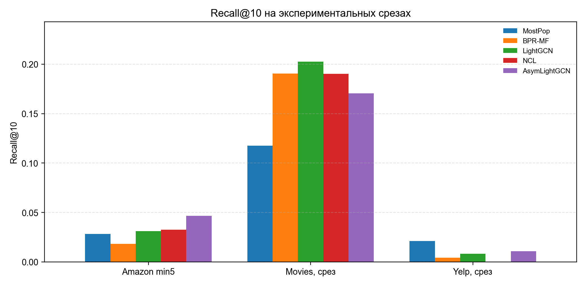
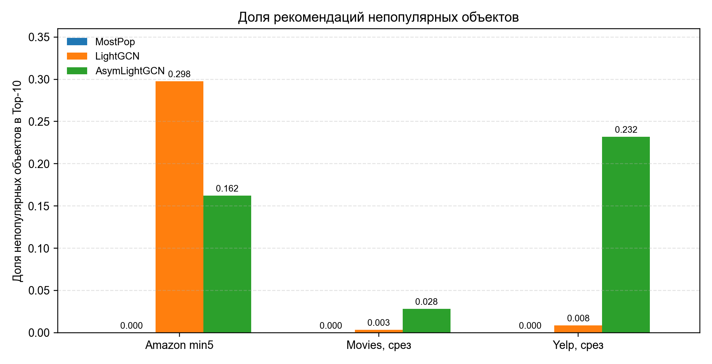

УДК 004.85  

# ДИАГНОСТИЧЕСКИЙ ПРОТОКОЛ ОЦЕНКИ ГРАФОВО-СЕМАНТИЧЕСКИХ РЕКОМЕНДАТЕЛЬНЫХ МОДЕЛЕЙ ПРИ РАЗРЕЖЕННЫХ ДАННЫХ

*Оригинальная статья*

Дубровин В. В., магистрант, ORCID ID: 0009-0001-0242-366X, dubrovinor@gmail.com (корр.)

Алаторцев Е. И., д.т.н., с.н.с., профессор, ORCID ID: 0009-0009-9851-5523, alatortsev@mirea.ru

Бабкин И. А., аспирант, ORCID ID: 0009-0008-1147-8727, naliab@yandex.ru

Федеральное государственное бюджетное образовательное учреждение высшего образования «МИРЭА - Российский технологический университет», Москва, Российская Федерация

## Аннотация

В рекомендательных системах с разреженными пользовательско-объектными взаимодействиями агрегированные метрики качества не всегда позволяют понять, за счет чего получен результат модели. Проблема усиливается, когда вместе с графом взаимодействий используются содержательные признаки объектов: текстовые описания, категории и метаданные. Цель исследования - разработать компактный диагностический протокол для интерпретации результатов графово-семантических рекомендательных моделей при разреженных данных и проверить его на нескольких доменах с различной ролью семантических признаков и популярностного смещения. Материалами исследования являются исходные коллекции Amazon Books, Movies и Yelp, а также экспериментальные срезы, подготовленные на их основе. Методика включает полное ранжирование с исключением известных пользователю объектов, семантический контроль, популярностный контроль, стратификацию по популярности объектов и проверку устойчивости сравнений. Показано, что исходный Amazon отражает семантическое доминирование, Amazon с минимальным числом взаимодействий 5 допускает ограниченный вывод об эмпирическом превосходстве относительно контролей, сокращенный срез Movies задает отрицательный мультимедийный контроль, а сокращенный срез Yelp демонстрирует популярностное доминирование. Предложенный протокол помогает формулировать более точные и воспроизводимые выводы о качестве рекомендательных моделей в автономных экспериментах данного типа, однако не заменяет причинную или пользовательскую онлайн-оценку.

Ключевые слова: рекомендательные системы, графовые рекомендательные модели, семантический контроль, популярностное смещение, стратифицированный анализ, разреженные данные, автономная оценка.

Благодарности: не заявлены.

# DIAGNOSTIC EVALUATION PROTOCOL FOR GRAPH-SEMANTIC RECOMMENDER MODELS UNDER SPARSE DATA

Dubrovin V. V., master's student, ORCID ID: 0009-0001-0242-366X, dubrovinor@gmail.com (corresponding author)

Alatortsev E. I., Doctor of Technical Sciences, Senior Researcher, Professor, ORCID ID: 0009-0009-9851-5523, alatortsev@mirea.ru

Babkin I. A., postgraduate student, ORCID ID: 0009-0008-1147-8727, naliab@yandex.ru

Federal State Budgetary Educational Institution of Higher Education "MIREA - Russian Technological University", Moscow, Russian Federation

## Abstract

In recommender systems with sparse user-item interactions, aggregate quality metrics do not always explain why a model obtains a particular result. This problem becomes more important when interaction graphs are combined with semantic item features such as textual descriptions, categories, and metadata. The purpose of the study is to develop a compact diagnostic protocol for interpreting the results of graph-semantic recommender models under sparse data and to test it on several domains with different roles of semantic features and popularity bias. The study uses source Amazon Books, Movies, and Yelp collections and experimental slices prepared from them. The protocol includes full ranking with exclusion of known items, semantic control, popularity control, item-popularity stratification, and stability checks for key comparisons. The results show that the original Amazon setting is dominated by semantic effects, Amazon with a minimum of five interactions supports a limited claim about empirical superiority over controls, the reduced Movies slice acts as a negative multimedia control, and the reduced Yelp slice demonstrates popularity dominance. The proposed protocol helps formulate more accurate and reproducible conclusions about recommender-model performance. It is intended as an offline diagnostic tool and does not replace causal analysis or online user evaluation.

Keywords: recommender systems, graph recommender models, semantic control, popularity bias, stratified analysis, sparse data, offline evaluation.

Acknowledgements: none.

## Введение

В исследованиях рекомендательных систем качество новых моделей часто оценивают по агрегированным метрикам ранжирования. Такой подход удобен для сравнения алгоритмов, но он не всегда отвечает на вопрос о причине полученного результата. Высокое значение метрики может быть связано не только с удачной архитектурой модели, но и с особенностями данных, семантической близостью объектов или популярностным смещением.

Для графовых рекомендательных моделей эта проблема особенно существенна. LightGCN использует структуру пользовательско-объектного графа и остается одной из сильных базовых моделей для совместной фильтрации [1]. NCL усиливает графовые представления за счет контрастивного обучения на соседстве [2]. Однако корректное сравнение таких моделей требует строгого протокола оценки: полного ранжирования или корректной выборки негативных объектов, единого разбиения данных и сопоставимых настроек обучения [3, 4].

Отдельная линия работ связана с популярностным смещением. Популярные объекты чаще встречаются в данных и могут получать преимущество в метриках даже без сложной персонализации [5]. Современные обзоры показывают, что популярностное смещение остается одной из ключевых проблем автономной оценки рекомендательных систем [6, 7]. Поэтому сравнение новой модели только с графовыми базовыми методами может быть недостаточным.

Еще один источник неоднозначной интерпретации связан с содержательными признаками объектов. Классические и современные гибридные подходы используют текстовые описания, категории и другие метаданные для поддержки рекомендаций [8, 9]. В разреженных данных такой сигнал может быть полезен, но он также способен создавать семантический короткий путь: модель или контрольный метод без полноценного графового обучения получает высокий результат только за счет близости описаний. В смежных работах по самоконтролируемому и контрастивному обучению для рекомендаций также подчеркивается необходимость отделять вклад архитектуры от свойств обучающего сигнала [10, 11].

Методы причинной и контрфактической оценки рекомендаций позволяют глубже анализировать смещения, но часто требуют информации о политике показа, вероятностях экспозиции или пользовательском эксперименте [12, 13]. В рассматриваемой постановке таких данных нет. Поэтому в статье решается более узкая, но практически значимая задача: сформировать диагностический протокол для автономной оценки, который помогает различать семантическое доминирование, популярностное доминирование, эмпирическое превосходство относительно контролей, смешанный режим и отрицательный перенос.

Российские публикации последних лет показывают, что близкие вопросы исследуются в нескольких направлениях. В отечественной литературе рассматриваются общие архитектуры рекомендательных систем, включая коллаборативные, контентные и гибридные подходы [14], применение графовых нейронных сетей к рекомендованию товаров в электронной коммерции [15], выбор метрик и процедур оценки качества рекомендаций [16], а также прикладные решения проблем холодного старта, разреженности данных и коррекции релевантности [17, 18]. В контексте предлагаемого диагностического протокола это имеет методическое значение: российские исследования фиксируют интерес не только к повышению точности, но и к объяснению условий, при которых рекомендательная модель дает устойчивый и интерпретируемый результат.

Практическая сложность такой оценки состоит в том, что один и тот же прирост метрики может иметь разные причины. Если модель использует содержательные признаки объектов, то улучшение может быть связано с действительно более удачным графовым представлением, с простой близостью текстовых описаний, с преобладанием популярных объектов в рекомендациях или с особенностями разбиения данных. В обычной сводной таблице эти эффекты оказываются смешанными. Поэтому для интерпретации результата требуется не только сравнение с сильными обучаемыми моделями, но и набор простых диагностических контролей, которые задают нижние и верхние ориентиры для объяснения качества.

В данной статье под диагностическим протоколом понимается не новая метрика и не замена стандартной экспериментальной оценки, а последовательность проверок, которые сопровождают основное сравнение моделей. Такой протокол особенно полезен для графово-семантических моделей: он позволяет отделить ситуацию, когда семантическая ветвь действительно помогает низкосвязным объектам, от случая, когда высокое качество уже достигается без обучения графовой модели. Тем самым протокол делает выводы более осторожными, но и более проверяемыми.

## Цель исследования

Цель исследования - разработать компактный диагностический протокол для интерпретации результатов графово-семантических рекомендательных моделей при разреженных данных и проверить его на нескольких доменах с различной ролью семантических признаков и популярностного смещения.

## Материал и методы исследования

Выбор графовых базовых моделей согласуется с современной линией исследований рекомендательных систем на графовых нейронных сетях [19]. Проверка протокола выполнена на экспериментальных срезах, подготовленных из трех источников данных: Amazon Books, Movies и Yelp [20, 21, 22]. Amazon-срезы используются для анализа разреженных графовых сценариев, сокращенный срез Movies - как прикладная мультимедийная проверка, сокращенный срез Yelp - как пример сильного популярностного смещения. Семантические признаки строились по текстовым описаниям и метаданным с использованием модели Sentence-BERT [23].

Выбор нескольких доменов связан с тем, что диагностический протокол должен проверяться не только на сценарии, где ожидается положительный результат. Amazon Books используется как каталог с текстово выраженными свойствами объектов и контролируемой разреженностью пользовательских историй. Сокращенный срез Movies отражает прикладной мультимедийный сценарий, но в проведенных экспериментах не дает положительного эффекта для графово-семантической модели. Сокращенный срез Yelp важен как случай, где агрегированная метрика чувствительна к популярности объектов. Такое сочетание данных позволяет показать не только успешный сценарий, но и два типа ограничений: отрицательный перенос и популярностное доминирование.

Ниже приведены характеристики основных рабочих экспериментальных срезов. Исходный Amazon дополнительно используется как диагностический стресс-тест семантического доминирования, поэтому его результаты представлены отдельно в разделе результатов и не смешиваются со сводной характеристикой основных рабочих срезов.

Характеристики экспериментальных срезов данных

| Набор данных | Пользователи | Объекты | Взаимодействия | Среднее на пользователя | Медиана на пользователя |
|---|---:|---:|---:|---:|---:|
| Amazon, минимум 5 | 1 433 | 6 841 | 13 670 | 9,539 | 7 |
| Movies, сокращенный срез | 265 879 | 6 387 | 3 307 732 | 12,441 | 9 |
| Yelp, сокращенный срез | 895 930 | 44 733 | 1 143 545 | 1,276 | 1 |

Примечание: таблица составлена авторами на основе подготовленных экспериментальных срезов данных.

В экспериментальную схему включены BPR-MF [24], LightGCN, NCL, AsymLightGCN, семантический контроль и популярностный контроль. Эксперименты проводились в среде RecBole [25, 26]. Для Amazon, минимум 5, основные результаты агрегировались по шести начальным состояниям генератора случайных чисел: 42, 43, 44, 45, 46 и 47. Для сокращенных срезов Movies и Yelp использовались три начальных состояния: 42, 43 и 44.

AsymLightGCN в данной работе рассматривается как графово-семантическая модификация LightGCN. Графовая часть строит пользовательский вектор \(e_u\) и коллаборативный вектор объекта \(g_i\) после \(L\) слоев нормированного распространения. Исходный семантический вектор объекта \(s_i\) проецируется в то же латентное пространство: \(z_i=P_s(s_i)\). В отличие от LightGCN, итоговый объектный вектор смешивает графовую и семантическую части с весом, зависящим от степени объекта \(c_i\) в обучающем графе:

\[
w_i=w_{max}\exp\left(-\frac{c_i}{\tau_g+\varepsilon}\right), \qquad
\tilde e_i=(1-w_i)g_i+w_i z_i.
\]

где \(w_{max}=0{,}8\), \(\tau_g\) - медиана положительных степеней объектов, \(\varepsilon\) - малая константа численной устойчивости. Для редких объектов \(w_i\) выше, поэтому семантический признак сильнее влияет на представление; для популярных объектов модель остается ближе к LightGCN. Обучение объединяет BPR-потерю с прототипной семантической регуляризацией:

\[
\mathcal L=\exp(-s_{bpr})\mathcal L_{BPR}+s_{bpr}
+\exp(-s_{sem})\mathcal L_{sem}+s_{sem}.
\]

При ранжировании используется оценка \(\hat y_{ui}=e_u^\top \tilde e_i/(\|\tilde e_i\|^\gamma+\varepsilon)\), где \(\gamma=0{,}25\). Псевдокод, конфигурации, split-протокол, скрипты построения семантических эмбеддингов и скрипты статистической обработки размещаются в отдельном публичном репозитории воспроизводимости: https://github.com/nIBOP/asym-lightgcn-reproducibility. Исходные наборы данных не включаются в архив реализации; они восстанавливаются по открытым страницам источников с сохранением указанных фильтров и контрольных статистик срезов.

Основные параметры запусков приведены ниже. Таблица фиксирует эффективный экспериментальный протокол, использованный для результатов статьи.

| Группа параметров | Значение |
|---|---|
| Разбиение и оценка | случайное \(80/10/10\), полное ранжирование, исключение обучающих объектов из выдачи |
| Метрики и выбор эпохи | Recall@10, NDCG@10, Recall@50, NDCG@50; valid metric - NDCG@10 |
| Оптимизация | Adam, learning rate 0,001, negative sampling - 1 отрицательный объект на положительный |
| Размерности и регуляризация | embedding size 64, \(L=2\) слоя для AsymLightGCN, \(reg\_weight=10^{-5}\) |
| Обучение reduced-срезов | максимум 90 эпох, train/eval batch size 8192, eval step 15, early stopping 2 |
| Семантическая ветвь AsymLightGCN | \(w_{max}=0{,}8\), \(\tau_{min}=0{,}2\), \(\tau_{max}=0{,}8\), semantic margin 0,8, \(\gamma=0{,}25\) |
| Повторные запуски | Amazon, минимум 5: 6 seed; Movies и Yelp: 3 seed |

Все модели сравнивались в едином режиме ранжирования. Для каждого пользователя из выдачи исключались объекты, присутствующие в обучающей части его истории, после чего качество оценивалось по оставшимся кандидатам. Такой порядок важен для сопоставимости результатов: если известные объекты не исключать, метрика может отражать не способность модели находить новые релевантные рекомендации, а повторное попадание уже наблюдавшихся взаимодействий. Использование одинакового разбиения и одинакового набора кандидатов снижает риск того, что различие между моделями объясняется не архитектурой или признаками, а техническими деталями оценки.

В качестве основных метрик использовались Recall@10, NDCG@10, Recall@50 и NDCG@50. Recall@K показывает долю релевантных тестовых объектов, попавших в первые \(K\) позиций выдачи, а NDCG@K дополнительно учитывает позицию найденных объектов. Поэтому расхождение между Recall и NDCG имеет содержательную интерпретацию: модель может увеличивать охват релевантных объектов в более широком списке, но не обязательно улучшать самые верхние позиции. Именно такая ситуация важна для анализа Amazon, минимум 5, где положительный эффект AsymLightGCN по Recall сочетается с сильным семантическим контролем по NDCG@10.

Диагностический протокол включает шесть шагов:

1. проверку разбиения данных и исключения известных пользователю объектов при ранжировании;
2. расчет основных метрик полноты и качества ранжирования для обучаемых моделей;
3. запуск семантического контроля, ранжирующего кандидаты по близости к семантическому профилю пользователя;
4. запуск популярностного контроля, ранжирующего объекты по частоте в обучающей части;
5. стратификацию объектов на популярный, средний и редкий сегменты;
6. проверку устойчивости ключевых сравнений между начальными состояниями и, где возможно, на уровне пользователей.

Семантический контроль строит профиль пользователя как среднее семантических векторов объектов из его обучающей истории и ранжирует кандидатов по косинусной близости:

\[
p_u=\frac{1}{|I_u^{train}|}\sum_{i\in I_u^{train}} s_i, \qquad
score_{sem}(u,j)=
\frac{p_u^\top s_j}{\|p_u\|\,\|s_j\|}.
\]

где \(p_u\) обозначает семантический профиль пользователя \(u\), \(I_u^{train}\) - множество объектов из обучающей истории этого пользователя, \(|I_u^{train}|\) - число таких объектов, а \(s_i\) и \(s_j\) - семантические векторы объектов, построенные по их содержательным признакам. Все известные пользователю объекты исключаются из списка кандидатов до расчета метрик.

Популярностный контроль упорядочивает кандидатов по числу обучающих взаимодействий объекта. В обоих контролях используется то же разбиение и то же множество кандидатов, что и для обучаемых моделей.

Семантический и популярностный контроли намеренно сделаны простыми. Их задача не состоит в том, чтобы предложить еще одну конкурентную модель, а в том, чтобы проверить возможное объяснение результата. Если разность между обучаемой моделью и контролем по ключевой метрике имеет доверительный интервал, включающий ноль, либо относительный зазор не превышает 5%, результат трактуется как диагностически близкий к контролю. Если популярностный контроль превосходит обучаемые модели, то агрегированная метрика в значительной степени отражает попадание в часто встречающиеся объекты. В обоих случаях формулировка вывода о преимуществе новой модели должна быть ограничена.

Стратификация по популярности объектов используется как дополнительный слой диагностики. Объекты разделяются на популярный, средний и редкий сегменты по числу взаимодействий в обучающей части. После этого анализируется не только общее значение метрик, но и то, какие сегменты каталога попадают в рекомендации. Такой анализ особенно важен для графово-семантических моделей, поскольку их ожидаемый эффект связан не с безусловным ростом общей метрики, а с поддержкой объектов, для которых графовый сигнал слабее. Если модель увеличивает долю редких объектов, но не получает релевантных попаданий в этом сегменте, такой результат нельзя считать подтверждением практического улучшения.

Итоговая интерпретация строится вокруг диагностического режима. Основные режимы диагностической интерпретации представлены ниже.

Правила диагностической интерпретации

| Диагностический режим | Формальный признак | Допустимый вывод |
|---|---|---|
| Семантическое доминирование | Semantic-only не ниже обучаемой модели либо разность неотличима от нуля по доверительному интервалу; для описательной проверки допускается относительный зазор \(\leq 5\%\) | Архитектурный вклад ограничен; часть качества объясняется содержательными признаками |
| Популярностное доминирование | MostPopIndependent не ниже обучаемых моделей по Recall/NDCG или превосходит их в большинстве ключевых метрик | Агрегированная метрика существенно зависит от популярности объектов |
| Эмпирическое превосходство относительно контролей | Обучаемая модель имеет положительную разность с графовыми базовыми методами и контролями; для основной метрики нижняя граница интервала больше нуля | Можно формулировать ограниченный положительный вывод |
| Смешанный режим | Вывод зависит от метрики, значения параметра \(K\) или сегмента объектов | Необходим вывод с явным указанием условий |
| Отрицательный перенос | Новая модель уступает базовым методам на домене | Метод не подтвержден для данного типа данных |

Примечание: таблица составлена авторами по результатам формализации предложенного диагностического протокола.

## Результаты исследования и их обсуждение

Ниже показано, как меняется интерпретация при фильтрации Amazon по минимальному числу взаимодействий пользователя. В исходном Amazon семантический контроль слишком силен, поэтому этот вариант не подходит как основной аргумент в пользу графового обучения. Amazon, минимум 5, дает более содержательный сценарий: AsymLightGCN превосходит LightGCN и NCL по метрикам полноты, но семантический контроль остается сильным по раннему ранжированию.

Результаты на вариантах Amazon

| Вариант данных | Метод | Начальные состояния | Recall@10 | NDCG@10 | Recall@50 | NDCG@50 |
|---|---|---|---:|---:|---:|---:|
| Исходный Amazon | Semantic-only | 42 | 0,2490 | 0,2201 | 0,2808 | 0,2274 |
| Исходный Amazon | LightGCN | 42 | 0,0116 | 0,0058 | 0,0423 | 0,0123 |
| Исходный Amazon | NCL | 42 | 0,0151 | 0,0072 | 0,0395 | 0,0124 |
| Исходный Amazon | AsymLightGCN | 42 | 0,1141 | 0,0629 | 0,2164 | 0,0853 |
| Amazon, минимум 5 | MostPopIndependent | 42/43/44/45/46/47 | 0,0282 ± 0,0037 | 0,0133 ± 0,0020 | 0,0851 ± 0,0066 | 0,0256 ± 0,0024 |
| Amazon, минимум 5 | Semantic-only | 42/43/44/45/46/47 | 0,0441 ± 0,0062 | 0,0287 ± 0,0053 | 0,0854 ± 0,0058 | 0,0378 ± 0,0051 |
| Amazon, минимум 5 | BPR-MF | 42/43/44/45/46/47 | 0,0181 ± 0,0042 | 0,0097 ± 0,0024 | 0,0415 ± 0,0064 | 0,0149 ± 0,0027 |
| Amazon, минимум 5 | LightGCN | 42/43/44/45/46/47 | 0,0311 ± 0,0036 | 0,0175 ± 0,0025 | 0,0878 ± 0,0026 | 0,0300 ± 0,0019 |
| Amazon, минимум 5 | NCL | 42/43/44/45/46/47 | 0,0326 ± 0,0052 | 0,0177 ± 0,0028 | 0,0906 ± 0,0041 | 0,0304 ± 0,0022 |
| Amazon, минимум 5 | AsymLightGCN | 42/43/44/45/46/47 | 0,0465 ± 0,0059 | 0,0232 ± 0,0035 | 0,1297 ± 0,0070 | 0,0413 ± 0,0038 |

Примечание: таблица составлена авторами по результатам экспериментальной оценки моделей.

Для проверки устойчивости использовались парные сравнения по начальным состояниям. Для Amazon, минимум 5, дополнительно пересчитаны пользовательские разности метрик: разности усреднялись по доступным seed, после чего для них строились бутстрэп-интервалы и непараметрические проверки. Для Movies и Yelp доступны три парных seed, поэтому минимальное возможное двустороннее значение точного знакового критерия равно 0,250; такие результаты используются как диагностические, а не как самостоятельное строгое доказательство.

| Сценарий | Сравнение | Проверка по метрикам Recall@10; NDCG@10; Recall@50; NDCG@50 | Диагностический вывод |
|---|---|---|---|
| Amazon, минимум 5 | AsymLightGCN - LightGCN | \(+0{,}0154\) \([0{,}0096;0{,}0211]\); \(+0{,}0057\) \([0{,}0022;0{,}0093]\); \(+0{,}0420\) \([0{,}0329;0{,}0513]\); \(+0{,}0112\) \([0{,}0074;0{,}0151]\) | Устойчиво выше графовой базы |
| Amazon, минимум 5 | AsymLightGCN - NCL | \(+0{,}0139\) \([0{,}0080;0{,}0200]\); \(+0{,}0055\) \([0{,}0021;0{,}0090]\); \(+0{,}0391\) \([0{,}0300;0{,}0484]\); \(+0{,}0109\) \([0{,}0073;0{,}0146]\) | Устойчиво выше NCL |
| Amazon, минимум 5 | AsymLightGCN - Semantic-only | \(+0{,}0024\) \([-0{,}0057;0{,}0101]\); \(-0{,}0055\) \([-0{,}0111;-0{,}0001]\); \(+0{,}0443\) \([0{,}0328;0{,}0559]\); \(+0{,}0035\) \([-0{,}0022;0{,}0091]\) | Смешанный режим: выигрыш по охвату, но не по раннему NDCG |
| Movies, сокращенный срез | AsymLightGCN - LightGCN | \(-0{,}0320\) \([-0{,}0405;-0{,}0235]\); \(-0{,}0197\) \([-0{,}0250;-0{,}0144]\); \(-0{,}0443\) \([-0{,}0513;-0{,}0373]\); \(-0{,}0227\) \([-0{,}0277;-0{,}0178]\) | Отрицательный перенос во всех ключевых метриках |
| Yelp, сокращенный срез | AsymLightGCN - LightGCN | \(+0{,}0026\) \([0{,}0008;0{,}0045]\); \(+0{,}0013\) \([-0{,}0001;0{,}0028]\); \(+0{,}0039\) \([0{,}0030;0{,}0047]\); \(+0{,}0017\) \([0{,}0008;0{,}0026]\) | Выше LightGCN, но требуется контроль популярности |
| Yelp, сокращенный срез | AsymLightGCN - MostPopIndependent | \(-0{,}0101\) \([-0{,}0114;-0{,}0089]\); \(-0{,}0050\) \([-0{,}0060;-0{,}0040]\); \(-0{,}0329\) \([-0{,}0347;-0{,}0311]\); \(-0{,}0098\) \([-0{,}0103;-0{,}0092]\) | Популярностное доминирование |

Примечание: для Amazon приведены пользовательские бутстрэп-интервалы; для Movies и Yelp - интервалы по парным seed. Таблица составлена авторами по результатам повторной статистической обработки экспериментальных логов.

Содержательно этот результат означает, что фильтрация Amazon по минимальному числу взаимодействий меняет диагностический режим. В исходном Amazon семантическая близость объектов сама по себе объясняет слишком большую часть качества. После перехода к варианту Amazon, минимум 5, графовые базовые модели становятся сильнее, а разница между AsymLightGCN и контролями перестает быть однозначной. Поэтому этот сценарий не дает простого вывода о полном превосходстве модели, но показывает область, где семантическая поддержка может увеличивать полноту рекомендаций относительно LightGCN и NCL в автономной оценке.

Для сопоставления основных моделей использована диаграмма Recall@10 по экспериментальным срезам данных.

Recall@10 для основных моделей и экспериментальных срезов данных  
Примечание: составлено авторами по результатам экспериментальной оценки.

Сокращенный срез Yelp демонстрирует популярностное доминирование. При сравнении только обучаемых моделей AsymLightGCN получает более высокие значения, чем LightGCN. Однако популярностный контроль оказывается выше всех обучаемых моделей по агрегированным метрикам. Поэтому результаты на данном срезе Yelp не подтверждают практическое превосходство графово-семантической модели.

Этот случай показывает, почему сравнение только между обучаемыми моделями может быть недостаточным. Если AsymLightGCN превосходит LightGCN, но при этом простая популярностная стратегия дает более высокое значение Recall и NDCG, то положительный результат относительно одной базовой модели не является самостоятельным доказательством качества. Для такой структуры данных более важным становится вопрос о том, насколько модель способна выйти за пределы популярностной выдачи и улучшить персонализацию. В проведенной оценке такого вывода сделать нельзя: результаты Yelp указывают прежде всего на необходимость контролировать популярностное смещение.

Результаты на сокращенном срезе Yelp

| Метод | Начальные состояния | Recall@10 | NDCG@10 | Recall@50 | NDCG@50 |
|---|---|---:|---:|---:|---:|
| MostPopIndependent | 42/43/44 | 0,0210 ± 0,0002 | 0,0106 ± 0,0001 | 0,0608 ± 0,0002 | 0,0192 ± 0,0001 |
| Semantic-only | 42/43/44 | 0,0054 ± 0,0000 | 0,0032 ± 0,0000 | 0,0130 ± 0,0001 | 0,0048 ± 0,0000 |
| BPR-MF | 42/43/44 | 0,0042 ± 0,0001 | 0,0020 ± 0,0001 | 0,0140 ± 0,0003 | 0,0042 ± 0,0001 |
| LightGCN | 42/43/44 | 0,0082 ± 0,0005 | 0,0043 ± 0,0004 | 0,0241 ± 0,0005 | 0,0077 ± 0,0004 |
| AsymLightGCN | 42/43/44 | 0,0109 ± 0,0003 | 0,0056 ± 0,0003 | 0,0279 ± 0,0008 | 0,0094 ± 0,0002 |

Примечание: таблица составлена авторами по результатам экспериментальной оценки моделей.

Сокращенный срез Movies рассматривается как мультимедийный сценарий с отрицательным результатом. В этом срезе семантический контроль практически не работает, а AsymLightGCN уступает LightGCN и BPR-MF. Такой результат задает важную границу применимости: семантическая поддержка не становится автоматически полезной даже в мультимедийном домене.

Отрицательный результат на Movies имеет самостоятельную методическую ценность. Он показывает, что наличие мультимедийной предметной области и содержательных признаков не гарантирует полезности семантического вмешательства. Возможны ситуации, когда пользовательские предпочтения лучше восстанавливаются по структуре взаимодействий, чем по доступным описаниям и метаданным. Поэтому прикладная интерпретация графово-семантической модели должна учитывать качество самих признаков, плотность пользовательских историй и соответствие семантической близости реальному поведению пользователей.

Результаты на сокращенном срезе Movies

| Метод | Начальные состояния | Recall@10 | NDCG@10 | Recall@50 | NDCG@50 |
|---|---|---:|---:|---:|---:|
| MostPopIndependent | 42/43/44 | 0,1176 ± 0,0004 | 0,0621 ± 0,0003 | 0,2805 ± 0,0001 | 0,0990 ± 0,0002 |
| Semantic-only | 42/43/44 | 0,0015 ± 0,0001 | 0,0007 ± 0,0000 | 0,0087 ± 0,0002 | 0,0022 ± 0,0000 |
| BPR-MF | 42/43/44 | 0,1906 ± 0,0009 | 0,1051 ± 0,0005 | 0,4336 ± 0,0029 | 0,1598 ± 0,0008 |
| LightGCN | 42/43/44 | 0,2024 ± 0,0012 | 0,1142 ± 0,0008 | 0,4381 ± 0,0044 | 0,1675 ± 0,0015 |
| NCL | 42 | 0,1903 | 0,1076 | 0,4221 | 0,1600 |
| AsymLightGCN | 42/43/44 | 0,1704 ± 0,0029 | 0,0945 ± 0,0016 | 0,3938 ± 0,0039 | 0,1447 ± 0,0017 |

Примечание: таблица составлена авторами по результатам экспериментальной оценки моделей.

Стратификация уточняет, какие именно объекты попадают в рекомендации. На Amazon, минимум 5, AsymLightGCN получает Recall@10 по редким объектам 0,0409 против 0,0008 у LightGCN и 0,0011 у NCL. На сокращенном срезе Movies модель увеличивает долю непопулярных рекомендаций, но не получает релевантных попаданий в этом сегменте. На сокращенном срезе Yelp доля непопулярных рекомендаций у AsymLightGCN выше, чем у LightGCN, однако агрегированное качество остается ниже популярностного контроля.

Отдельно рассмотрена доля рекомендаций непопулярных объектов в первых десяти позициях выдачи.

Доля рекомендаций непопулярных объектов в первых десяти рекомендациях  
Примечание: составлено авторами по результатам стратифицированного анализа.

Ниже приведена сводная диагностическая интерпретация результатов.

Диагностические выводы

| Случай | Ключевой признак | Режим | Допустимый вывод |
|---|---|---|---|
| Исходный Amazon | Semantic-only выше обучаемых графовых моделей | Семантическое доминирование | Нельзя использовать как основной аргумент графового обучения |
| Amazon, минимум 5 | AsymLightGCN выше LightGCN/NCL по Recall, но Semantic-only силен по NDCG@10 | Смешанный режим с эмпирическим превосходством по охвату | Можно говорить об улучшении охвата при явном ограничении вывода |
| Movies, сокращенный срез | AsymLightGCN уступает LightGCN и BPR-MF | Отрицательный перенос | Семантическая поддержка не подтверждена для данного экспериментального среза |
| Yelp, сокращенный срез | MostPopIndependent выше всех обучаемых моделей | Популярностное доминирование | Улучшение относительно LightGCN не доказывает практического превосходства |

Примечание: таблица составлена авторами по результатам применения диагностического протокола.

Результаты показывают, что один и тот же численный прирост может иметь разные объяснения. На Amazon, минимум 5, AsymLightGCN улучшает графовые базовые модели по полноте ранжирования, но часть раннего ранжирования остается объяснимой семантическим контролем. На сокращенном срезе Yelp агрегированные метрики в значительной степени связаны с популярностью объектов. На сокращенном срезе Movies отрицательный результат фиксирует границу применимости графово-семантического вмешательства.

С практической точки зрения предложенный протокол можно использовать как предварительный фильтр перед более дорогими экспериментами. Если новая модель не превосходит семантический или популярностный контроль, то переход к более сложной оценке требует дополнительного обоснования. Если модель улучшает базовые методы только в отдельных метриках или сегментах, вывод должен формулироваться с указанием этих условий. Если же улучшение сохраняется относительно обучаемых моделей и простых контролей, а также подтверждается в целевых сегментах каталога, результат можно считать более обоснованным кандидатом для дальнейшей онлайн- или пользовательской проверки.

Для внедрения графово-семантических моделей такой подход задает несколько практических проверок. До запуска модели необходимо оценить долю редких объектов, качество содержательных признаков и силу простых контрольных стратегий. После обучения следует сопоставлять не только средние метрики, но и поведение в сегментах популярности. Наконец, при подготовке вывода важно отделять автономную диагностическую оценку от утверждений о пользовательском эффекте: даже устойчивый offline-результат не доказывает улучшение пользовательского опыта без онлайн-эксперимента или отдельного пользовательского исследования.

Область применимости протокола ограничена несколькими условиями. Во-первых, все эксперименты являются автономной оценкой и не заменяют онлайн-проверку пользовательского эффекта. Во-вторых, применялось случайное разбиение 80/10/10, а не временной протокол. В-третьих, пользовательские bootstrap- и непараметрические проверки проведены для Amazon, минимум 5; Movies и Yelp проверялись по парным seed и поэтому интерпретируются осторожнее. В-четвертых, NCL на сокращенных срезах Movies и Yelp не используется как центральное доказательство из-за неполной серии повторных запусков. Наконец, протокол не является причинной оценкой: он диагностирует источники качества, но не восстанавливает контрфактический эффект рекомендационной политики.

## Заключение

В статье предложен диагностический протокол оценки графово-семантических рекомендательных моделей при разреженных данных. Протокол объединяет полное ранжирование, семантический и популярностный контроль, стратификацию по популярности объектов и проверку устойчивости ключевых сравнений. Применение протокола к исходному Amazon, Amazon с минимальным числом взаимодействий 5, а также к сокращенным срезам Movies и Yelp показало, что агрегированные метрики качества нельзя интерпретировать без дополнительных контролей. Для близких экспериментальных сценариев основной результат целесообразно сопровождать диагностическим режимом: семантическим доминированием, популярностным доминированием, эмпирическим превосходством относительно контролей, смешанным режимом или отрицательным переносом. Такой подход делает выводы о качестве рекомендательных моделей более проверяемыми и снижает риск завышенной интерпретации результата.

Полученные результаты подтверждают необходимость рассматривать качество графово-семантической модели не как одно агрегированное число, а как совокупность условий: домен данных, разреженность пользовательских историй, сила семантического контроля, вклад популярности и поведение в редком сегменте каталога. Наиболее содержательный положительный сценарий выявлен на Amazon, минимум 5, где AsymLightGCN улучшает полноту рекомендаций относительно LightGCN и NCL. Одновременно результаты на Movies и Yelp показывают границы применимости: в одном случае семантическая поддержка приводит к отрицательному переносу, в другом агрегированное качество сильнее объясняется популярностным контролем. Поэтому основной вклад работы состоит не в утверждении универсального преимущества конкретной модели, а в формализации воспроизводимой процедуры, которая помогает различать источники полученного качества.

## Список литературы

1. He X., Deng K., Wang X., Li Y., Zhang Y., Wang M. LightGCN: Simplifying and Powering Graph Convolution Network for Recommendation // Proceedings of the 43rd International ACM SIGIR Conference on Research and Development in Information Retrieval. 2020. P. 639-648. DOI: 10.1145/3397271.3401063.
2. Lin Z., Tian C., Hou Y., Zhao W.X. Improving Graph Collaborative Filtering with Neighborhood-enriched Contrastive Learning // Proceedings of the ACM Web Conference 2022. 2022. P. 2320-2329. DOI: 10.1145/3485447.3512104.
3. Krichene W., Rendle S. On Sampled Metrics for Item Recommendation // Proceedings of the 26th ACM SIGKDD International Conference on Knowledge Discovery and Data Mining. 2020. P. 1748-1757. DOI: 10.1145/3394486.3403226.
4. Sun Z., Yu D., Fang H., Yang J., Qu X., Zhang J., Geng C. Are We Evaluating Rigorously? Benchmarking Recommendation for Reproducible Evaluation and Fair Comparison // Proceedings of the 14th ACM Conference on Recommender Systems. 2020. P. 23-32. DOI: 10.1145/3383313.3412489.
5. Abdollahpouri H., Burke R., Mobasher B. Managing Popularity Bias in Recommender Systems with Personalized Re-Ranking // Proceedings of the 32nd International Florida Artificial Intelligence Research Society Conference. 2019. P. 413-418. URL: https://dblp.org/rec/conf/flairs/AbdollahpouriBM19 (дата обращения: 03.06.2026).
6. Klimashevskaia A., Jannach D., Elahi M., Trattner C. A survey on popularity bias in recommender systems // User Modeling and User-Adapted Interaction. 2024. Vol. 34. P. 1777-1834. DOI: 10.1007/s11257-024-09406-0.
7. Chen J., Dong H., Wang X., Feng F., Wang M., He X. Bias and Debias in Recommender System: A Survey and Future Directions // ACM Transactions on Information Systems. 2023. Vol. 41. No. 3. Article 67. P. 1-39. DOI: 10.1145/3564284.
8. Melville P., Mooney R.J., Nagarajan R. Content-Boosted Collaborative Filtering for Improved Recommendations // Proceedings of the 18th National Conference on Artificial Intelligence. 2002. P. 187-192. URL: https://www.cs.utexas.edu/~ml/papers/cbcf-aaai-02.pdf (дата обращения: 03.06.2026).
9. Kula M. Metadata Embeddings for User and Item Cold-start Recommendations // Proceedings of the 2nd Workshop on New Trends on Content-Based Recommender Systems. CEUR Workshop Proceedings. 2015. Vol. 1448. P. 14-21. URL: https://ceur-ws.org/Vol-1448/paper4.pdf (дата обращения: 03.06.2026).
10. Yu J., Yin H., Xia X., Chen T., Li J., Huang Z. Self-Supervised Learning for Recommender Systems: A Survey // IEEE Transactions on Knowledge and Data Engineering. 2024. Vol. 36. No. 1. P. 335-355. DOI: 10.1109/TKDE.2023.3282907.
11. Jing M., Zhu Y., Zang T., Wang K. Contrastive Self-supervised Learning in Recommender Systems: A Survey // ACM Transactions on Information Systems. 2024. Vol. 42. No. 2. Article 59. P. 1-39. DOI: 10.1145/3627158.
12. Schnabel T., Swaminathan A., Singh A., Chandak N., Joachims T. Recommendations as Treatments: Debiasing Learning and Evaluation // Proceedings of the 33rd International Conference on Machine Learning. PMLR. 2016. Vol. 48. P. 1670-1679. URL: https://proceedings.mlr.press/v48/schnabel16.html (дата обращения: 03.06.2026).
13. Zhu Y., Ma J., Li J. Causal Inference in Recommender Systems: A Survey of Strategies for Bias Mitigation, Explanation, and Generalization // arXiv. 2023. URL: https://arxiv.org/abs/2301.00910 (дата обращения: 03.06.2026). DOI: 10.48550/arXiv.2301.00910.
14. Ляликова В.Г., Безрядин М.М. Обзор современных рекомендательных систем // Информационные технологии. 2022. Т. 28. № 9. С. 456-464. DOI: 10.17587/it.28.456-464. URL: https://journals.eco-vector.com/1684-6400/article/view/702586 (дата обращения: 03.06.2026).
15. Золотаревский А.Ю., Блохин Н.В. Применение графовых нейронных сетей для построения системы рекомендаций товаров интернет-магазина // Мягкие измерения и вычисления. 2024. № 1-2. С. 22-29. DOI: 10.36871/2618-9976.2024.01-2.003. URL: https://s-lib.com/issues/smc_2024_01_2_a3/ (дата обращения: 03.06.2026).
16. Кульшин Р.С., Сидоров А.А. Обобщенная метрика оценки эффективности алгоритмов рекомендательных систем на основе энтропийного метода // Проблемы управления. 2024. № 4. С. 44-60. DOI: 10.25728/pu.2024.4.4. URL: https://journals.rcsi.science/1819-3161/article/view/272865 (дата обращения: 03.06.2026).
17. Головинский П.А., Шаталова А.О. Нечеткая рекомендательная система с холодным стартом для выбора траектории обучения // Проблемы управления. 2023. № 6. С. 33-41. DOI: 10.25728/pu.2023.6.3. URL: https://journals.rcsi.science/1819-3161/article/view/292103 (дата обращения: 03.06.2026).
18. Митрохин М.А., Мартышкин А.И., Ионова Д.Н., Федяшов М.С., Горынина А.В. Метод корректировки релевантности для рекомендательных систем // Современные наукоемкие технологии. 2023. № 12 (часть 1). С. 60-66. DOI: 10.17513/snt.39861. URL: https://top-technologies.ru/ru/article/view?id=39861 (дата обращения: 03.06.2026).
19. Anand V., Maurya A.K. A Survey on Recommender Systems Using Graph Neural Network // ACM Transactions on Information Systems. 2025. Vol. 43. No. 1. Article 9. P. 1-49. DOI: 10.1145/3694784.
20. Bakhet M. Amazon Books Reviews [Набор данных; версия Kaggle, обновление страницы 2022] // Kaggle. URL: https://www.kaggle.com/datasets/mohamedbakhet/amazon-books-reviews (дата обращения: 28.06.2026).
21. Banik R. The Movies Dataset [Набор данных; версия Kaggle, 2017] // Kaggle. URL: https://www.kaggle.com/datasets/rounakbanik/the-movies-dataset (дата обращения: 28.06.2026).
22. Yelp Inc. Yelp Open Dataset [Набор данных; версия 2022] [Электронный ресурс]. URL: https://business.yelp.com/data/resources/open-dataset/ (дата обращения: 28.06.2026).
23. Sentence Transformers. all-MiniLM-L6-v2 [модель; карточка Hugging Face, опубликована в 2021 г.] // Hugging Face. URL: https://huggingface.co/sentence-transformers/all-MiniLM-L6-v2 (дата обращения: 28.06.2026).
24. Rendle S., Freudenthaler C., Gantner Z., Schmidt-Thieme L. BPR: Bayesian Personalized Ranking from Implicit Feedback // Proceedings of the 25th Conference on Uncertainty in Artificial Intelligence. 2009. P. 452-461. URL: https://mlanthology.org/uai/2009/rendle2009uai-bpr/ (дата обращения: 03.06.2026).
25. Zhao W.X., Mu S., Hou Y., Lin Z., Chen Y., Pan X., Li K., Lu Y., Wang H., Tian C., Min Y., Feng Z., Fan X., Chen X., Wang P., Ji W., Li Y., Wang X., Wen J.-R. RecBole: Towards a Unified, Comprehensive and Efficient Framework for Recommendation Algorithms // Proceedings of the 30th ACM International Conference on Information and Knowledge Management. 2021. P. 4653-4664. DOI: 10.1145/3459637.3482016.
26. Zhao W.X., Hou Y., Pan X., Yang C., Zhang Z., Lin Z., Zhang J., Bian S., Tang J., Sun W., Chen Y., Xu L., Zhang G., Tian Z., Tian C., Mu S., Fan X., Chen X., Wen J.-R. RecBole 2.0: Towards a More Up-to-Date Recommendation Library // Proceedings of the 31st ACM International Conference on Information & Knowledge Management. 2022. P. 4722-4726. DOI: 10.1145/3511808.3557680.

## Конфликт интересов

Автор заявляет об отсутствии конфликта интересов.

## Conflict of interest

The author declares no conflict of interest.

## Финансирование

Исследование выполнено без внешнего финансирования.

## Financing

The study was conducted without external funding.

## Вклад автора

Дубровин В. В.: разработка концепции, методология исследования, работа с данными, анализ данных, проведение исследования, программная реализация, подготовка и редактирование текста рукописи.
